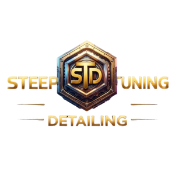
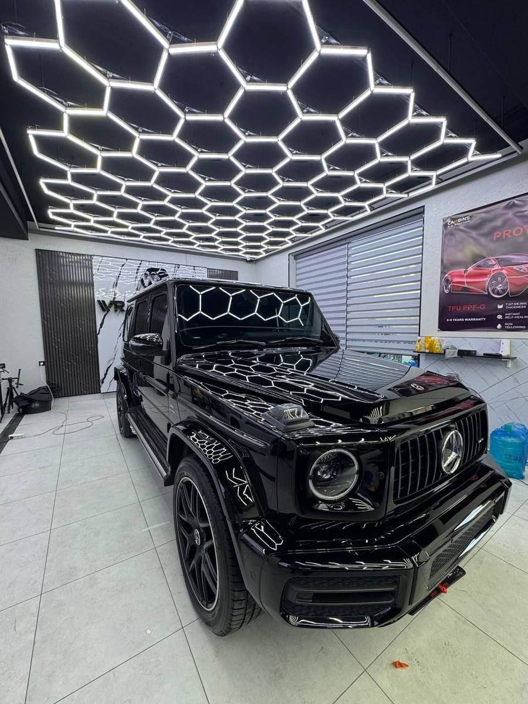
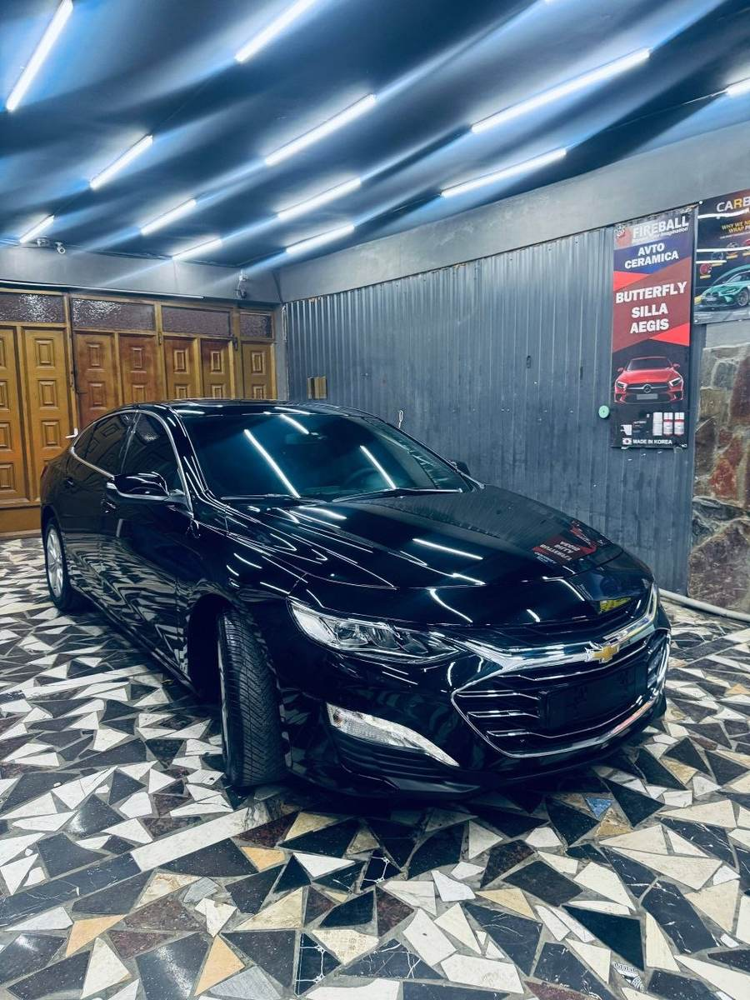
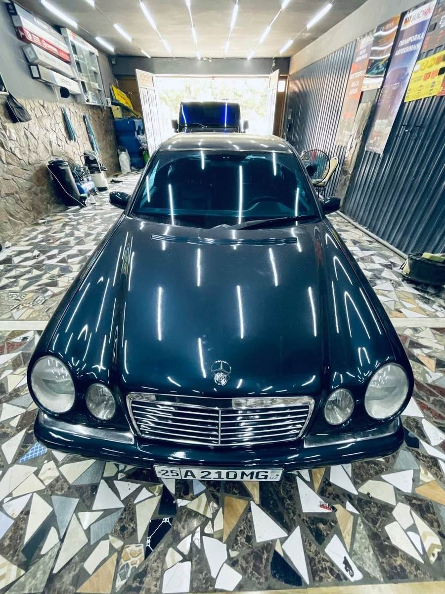
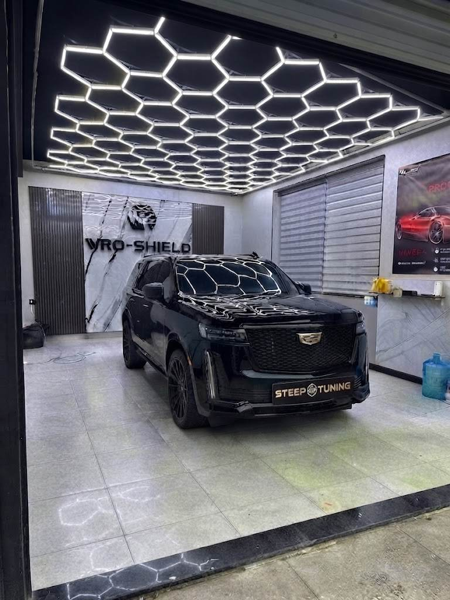
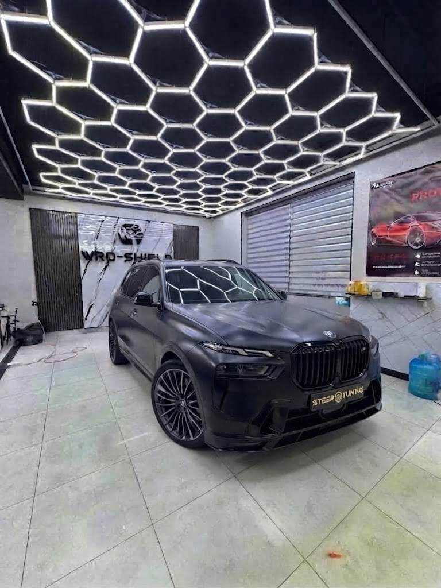
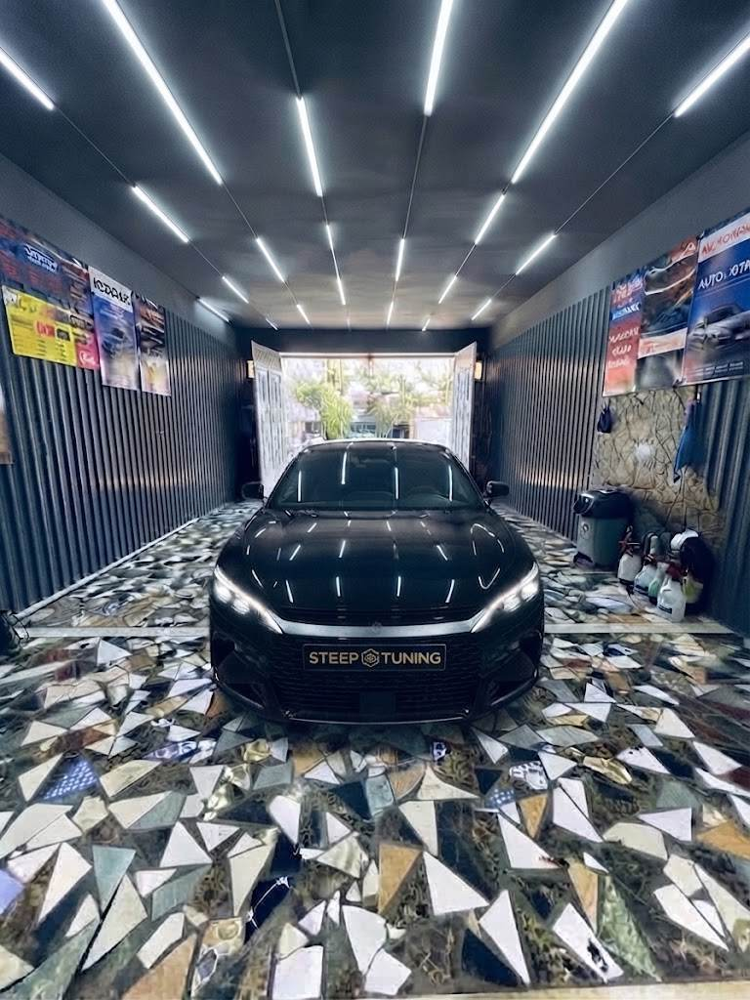

<p align="center">
  
</p>

<h1 align="center">STEEP TUNING DETAILING</h1>

<p align="center">
  Ko'p tilli (RU / EN / UZ) statik landing sayt — avtomobil detailing va tyuning studiyasi uchun.<br>
  Framework yo'q, backend yo'q — toza HTML, CSS va JavaScript.
</p>

<p align="center">
  
  
  
  
  
</p>

---

## 📸 Ko'rinishi

<p align="center">
  
  
  
</p>
<p align="center">
  
  
  
</p>

---

## ✨ Xususiyatlari

- **3 til** — RU / EN / UZ, bitta tugma bilan almashtiriladi, tanlov brauzerda saqlanadi
- **Video fon** — hero bo'limida avtoloop video, jarayon videolarida ovoz yoqish/o'chirish tugmasi
- **Loyihalar galereyasi** — har bir mashina ustiga bosilganda to'liq sahifa kabi ochiladi: xizmat turlari, ish muddati, ishlatilgan material, mas'ul usta, natija va 5 yulduzli reyting (`#/project/:id` marshrutlash bilan)
- **Sharhlar bo'limi** — mijozlar ism, yulduz va matn bilan sharh qoldiradi, ro'yxat bosqichma-bosqich ("Показать ещё" tugmasi) ko'rsatiladi
- **Google Xarita** — koordinata bo'yicha joylashuv, "Открыть на карте" havolasi
- **To'liq moslashuvchan (responsive)** — mobil, planshet va desktop uchun

## 🛠 Texnologiyalar

Toza `HTML5`, `CSS3` (custom properties / grid / flexbox) va vanilla `JavaScript` — hech qanday tashqi kutubxona yoki build vositasi talab qilinmaydi.

## 📁 Loyiha tuzilishi

```
steep-tuning-site/
├── index.html          # Butun sayt — bitta fayl
├── assets/
│   ├── logo.png         # Logotip
│   ├── car*.jpg, n*.jpg # Loyihalar (portfolio) suratlari
│   └── *.mp4             # Hero va jarayon videolari
└── README.md
```

## 🚀 Ishga tushirish

Backend yoki build kerak emas — shunchaki `index.html` faylini brauzerda oching:

```bash
git clone https://github.com/<username>/steep-tuning-site.git
cd steep-tuning-site
open index.html   # yoki xohlagan brauzeringizda oching
```

## 🌐 Deploy qilish

Har qanday statik hostingga mos:

- **Netlify / Vercel** — repo'ni ulang, hech qanday build sozlamasi kerak emas
- **GitHub Pages** — `Settings → Pages → Deploy from branch` orqali yoqiladi
- **Har qanday shared hosting** — `index.html` va `assets/` papkasini yuklab, domenni bog'lang

## 📞 Aloqa

- Telegram: [@Steep_Tuning_Detailing](https://t.me/Steep_Tuning_Detailing)
- Instagram: [@steep_tuning](https://www.instagram.com/steep_tuning)

---

<p align="center"><sub>© 2026 Steep Tuning Detailing. Barcha huquqlar himoyalangan.</sub></p>
